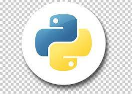
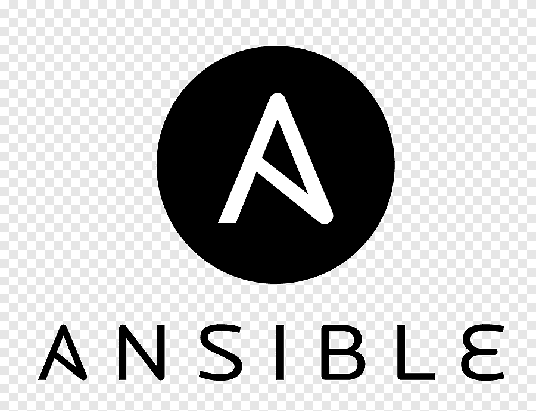
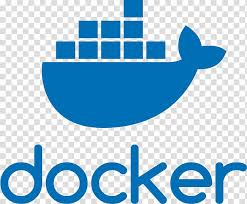
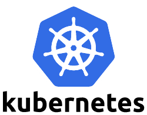
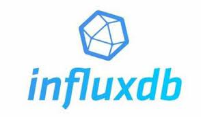

### Hi there, I'm Tanya 👋

## I'm a Developer and looking forward to exploring new technologies!!
- 🔭 I'm currently working as a Software Engineer in HSBC.
- 🌱 I’m currently learning everything 🤣 
- 🥅 2022 Goals: Start contributing to Open Source Software.
- ⚡ Fun Fact: I like dancing and reading books.

### Connect with me:

[][linkedin]
[][gmail]

 

### Language and Tools:

 
 

---

---

[linkedin]: https://www.linkedin.com/in/tanya-kansal
[gmail]: mailto:tanyakansal218@gmail.com?
